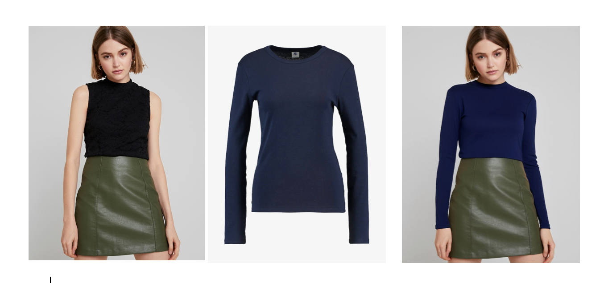

<div align="center">
<h1>IDM-VTON: Improving Diffusion Models for Authentic Virtual Try-on in the Wild</h1>
</div>

This is the unofficial train code of IDM-VTON ["Improving Diffusion Models for Authentic Virtual Try-on in the Wild"](https://arxiv.org/abs/2403.05139).
Most code from [IDM-VTON] https://github.com/yisol/IDM-VTON, only realize the train code for viton dataset

## train result

## Requirements

```
git clone https://github.com/luxiaolili/IDM-VTON-train/tree/main
cd IDM-VTON

conda env create -f environment.yaml
conda activate idm
```

## Data preparation

get the cloth mask and agnostic-v3.3 and put the image_mask and agnostic-v3.3 to train and test folder
```
python get_mask.py ../zalando-hd-resized/train/image  image_mask agnostic-v3.3

mv image_mask ../zalando-hd-resized/train/
mv agnostic-v3.3 ../zalando-hd-resized/train/

python get_mask.py ../zalando-hd-resized/test/image   image_mask agnostic-v3.3
mv image_mask ../zalando-hd-resized/test/
mv agnostic-v3.3 ../zalando-hd-resized/test/

```

### Chang the config

You can download idm model from https://huggingface.co/yisol/IDM-VTON/ for denspose, humanparsering, openpose, image_encoder, text_encoder

You can download vae model from https://huggingface.co/madebyollin/sdxl-vae-fp16-fix 

You need download sdxl-1.0 model from https://huggingface.co/stabilityai/stable-diffusion-xl-base-1.0

download sdxl-1.0-inpainting model from https://huggingface.co/diffusers/stable-diffusion-xl-1.0-inpainting-0.1

stable-diffusion-xl-1.0-inpainting-0.1 unet config update "encoder_hid_dim_type":"ip_image_proj", "encoder_hid_dim":1280

stabilityai/stable-diffusion-xl-base-1.0 unet config  delete "addition_embed_type":"text_time"

### VITON-HD
You can download VITON-HD dataset from [VITON-HD](https://github.com/shadow2496/VITON-HD).

After download VITON-HD dataset, move vitonhd_test_tagged.json into the test folder.

Structure of the Dataset directory should be as follows.

```

train
|-- image
|-- image-densepose
|-- agnostic-v3.3
|-- cloth
|-- img_mask
```


## Train

```
sh train.sh
```
or Run the following command

```
CUDA_VISIBLE_DEVICES=1  accelerate launch --num_processes 1 --mixed_precision "fp16" train.py \
  --pretrained_model_name_or_path="idm" \
  --inpainting_model_path="stable-diffusion-xl-1.0-inpainting-0.1" \
  --garmnet_model_path="stabilityai/stable-diffusion-xl-base-1.0" \
  --width=768 \
  --height=1024 \
  --data_json_file="vitonhd.json" \
  --data_root_path="../zalando-hd-resized" \
  --mixed_precision="fp16" \
  --train_batch_size=1 \
  --dataloader_num_workers=6 \
  --learning_rate=1e-05 \
  --weight_decay=0.01 \
  --output_dir="idm_plus_output_up"\
  --save_steps=50000
  ```

## Test
put the train model in the idm folder and simply run with the script file. 

```
cd checkpoint-50000 
mv pytorch_model.bin diffusion_pytorch_model.bin
mkdir unet
mv * unet
cp ../stable-diffusion-xl-1.0-inpainting-0.1/unet/config.json unet
sh tesh.sh
```
or Run the following command:

```
CUDA_VISIBLE_DEVICES=0 accelerate launch --mixed_precision "fp16" test.py \
--pretrained_model_name_or_path="idm" 
```

```python
python gradio_demo/app.py
```


## Acknowledgements

Thanks [IDM-VTION] https://github.com/yisol/IDM-VTON for most codes.

Thanks [ZeroGPU](https://huggingface.co/zero-gpu-explorers) for providing free GPU.

Thanks [IP-Adapter](https://github.com/tencent-ailab/IP-Adapter) for base codes.

Thanks [OOTDiffusion](https://github.com/levihsu/OOTDiffusion) and [DCI-VTON](https://github.com/bcmi/DCI-VTON-Virtual-Try-On) for masking generation.

Thanks [SCHP](https://github.com/GoGoDuck912/Self-Correction-Human-Parsing) for human segmentation.

Thanks [Densepose](https://github.com/facebookresearch/DensePose) for human densepose.


## License
The codes and checkpoints in this repository are under the [CC BY-NC-SA 4.0 license](https://creativecommons.org/licenses/by-nc-sa/4.0/legalcode).


